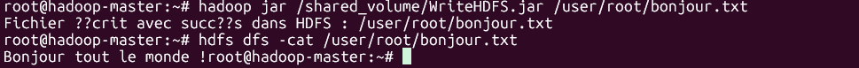

# Mon projet Hadoop

Le Projet lab1 contient des classes Java pour lire et écrire dans HDFS.

## Installation du Lab Hadoop

1. Installer Docker et ses dépendances.
2. Cloner le projet :

 ```bash
   git clone https://github.com/Dianamikolo/BigdataLabs.git
   cd BigdataLabs/hadoop_lab
   docker compose up -d
   ```

## Description

- Classe `WriteHDFS` : écrit un fichier dans HDFS

### Capture d'écran



- Classe `ReadHDFS` : lit un fichier depuis HDFS
